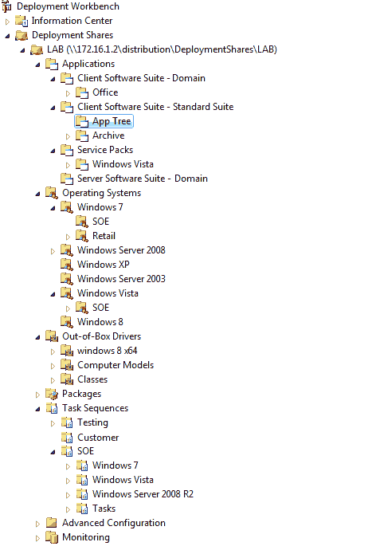
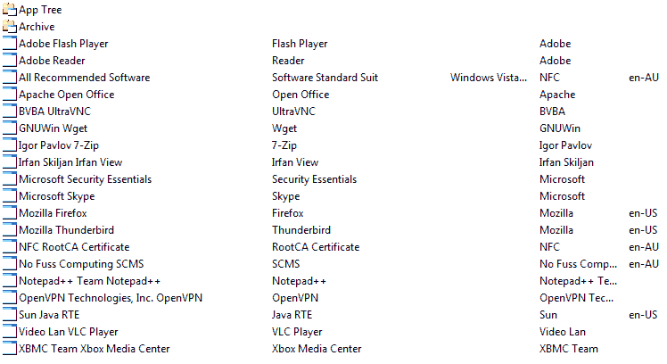

!!! info
    This information has been created as a record of how I do something, if you decide to follow anything within this set of pages and stuff up, you're on your own!!

I use Microsoft Deployment Tool Kit (MDT) to reduce the time it takes to install/update and to deploy a working Windows OS. The setup of MDT and time taken to test and get it right far outweighs deploying an OS by hand. Below you will find how I have setup my MDT structure and why. Most of my setup has been chopped and changed due to trial and error and to ease the burden.

My goals for MDT are:

- Deploy any Windows OS quickly
- Easily update Applications / Drivers / Operating System
- make deployment media that could be used by a less savvy computer user.

I currently use MDT to Deploy windows on my own network (Active Directory Domain), Stand alone machines and family and friends computers. I also use MDT to install applications and force a computer to update using my WSUS Server.

## Folder Layout

## Applications

I not only use MDT to deploy applications during OS deployment but I also have a 'Post OS Install' task sequence to install applications as well.

Application folders Layout is pretty straight forward.

- Client Software Suite - Standard Suite

    All Freeware applications that I install is under this structure

- Client Software Suite - Domain

    Local Domain only Applications

- Server Software Suite - Domain

      Software for use on domain Servers

Each suite folder is setup as follows.

|  Folder  |  Description  |
|:----|:----|
| Suite  | Applications listed here are only Application Bundles. The dependent applications for these Application bundles are selected from the AppTree folder. They are visible from the deployment wizard.  |
| Suite\AppTree  | Applications here are 'Applications with Source files' these applications are contain the acutual installers for the application in question. They are not visible from the deployment wizard.  |
| Suite\Archive  | Applications here are old versions, they are visible from the deployment wizard.  |

  
**Figure 1. AppTree Folder Structure** This is where new applications are imported to they are imported as an application with source files.

  
**Figure 2. Suite Application bundles** These applications are application bundles with the application under the app tree folder added as a dependency.

### Add New Application
To add a new application the following process is followed.

- Import an application with source files into the AppTree Folder ensuring you hide it from the deployment wizard.

- Create an application Bundle under the Suite root folder and set its dependency to the application you wish to install, from the AppTree folder.

- if the application you wish to install has dependent applications, select the dependent application bundle from the suite root folder making sure it is set to install before the application that requires it does.

### Update an Application

- Import an application with source files into the AppTree Folder ensuring you hide it from the deployment wizard.

- goto the application Bundle under the Suite root folder and set its dependency to the application you just added to the AppTree folder and remove the old version of that application.

- return to the AppTree folder and move the old app to the Archive directory making sure you 'uncheck' the 'hide from deployment wizard'.

### other useful info

- utilize the uninstall key, within each application it will prevent the app from trying to install again.

### Reasoning
This structure was adopted for the following reasons:

- Create Deployment media based on suites (Departments / Groups / ETC.)

- If you have mandatory applications in your config file providing you have used the Suit 'Application Bundle' you don't have to leave the GUI/Edit the config file to update the application.

- clarity

!!! attention
    This post is considered an archived post.

    This article was originally posted on 01 Sep 2014. It has been migrated from its original source http://nofusscomputing.com/wiki/public/help/mdt/home and http://nofusscomputing.com/wiki/public/help/mdt/applications to here.